# Testing-screenshots

### 

### live frontend: https://MovieVault.vercel.app
### github Backend: https://github.com/Blitzcranq/MovieVaultAPI

## Screenshots
first load 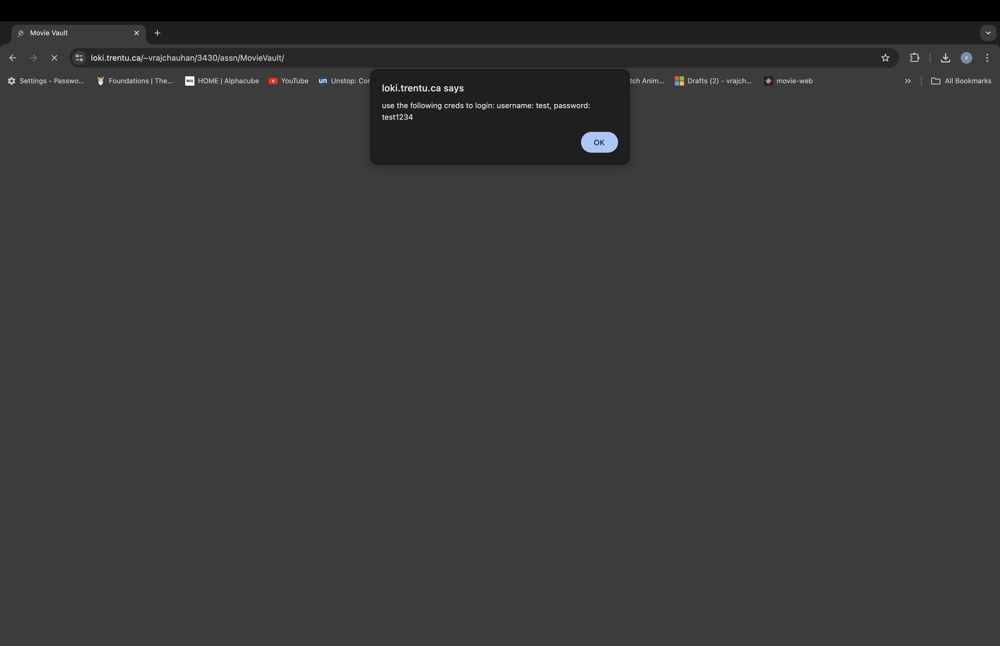
#
login page 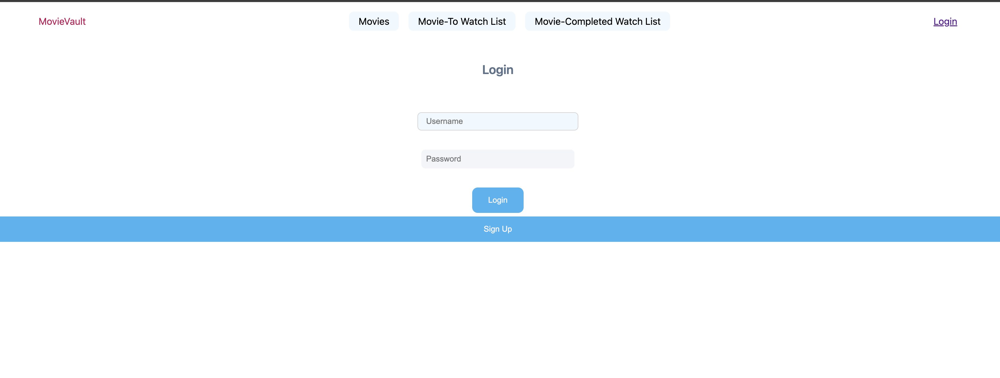
#
signup page 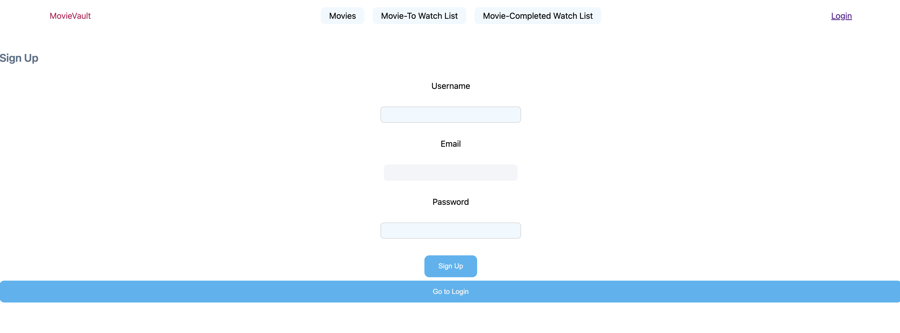
#
invalid login 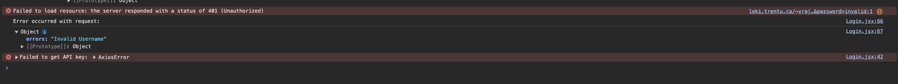
#
valid login-> redirect to movies catalouge 
#
filters (year, title, genre and language works both individual and combined) 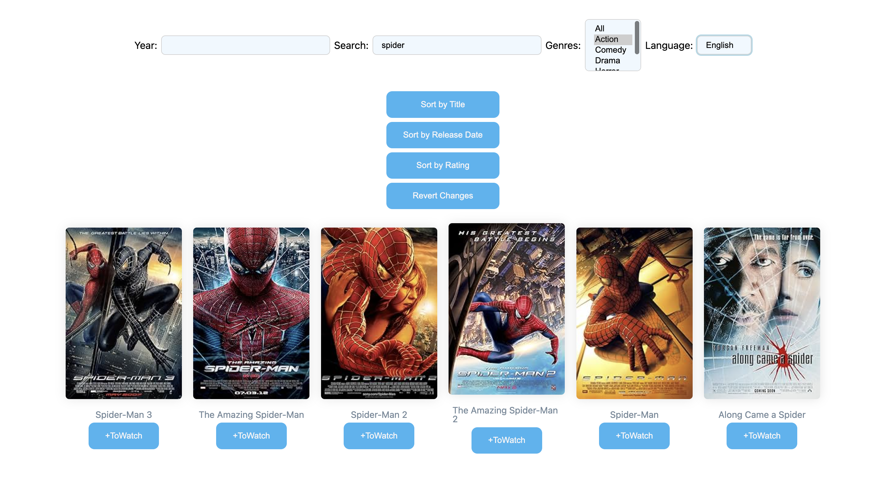
sort by title 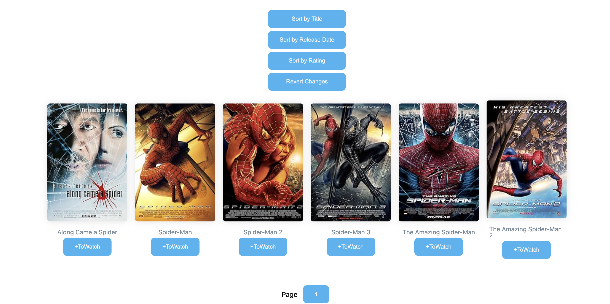 ( 2 more works the same way):release date and rating
hover over movie card
#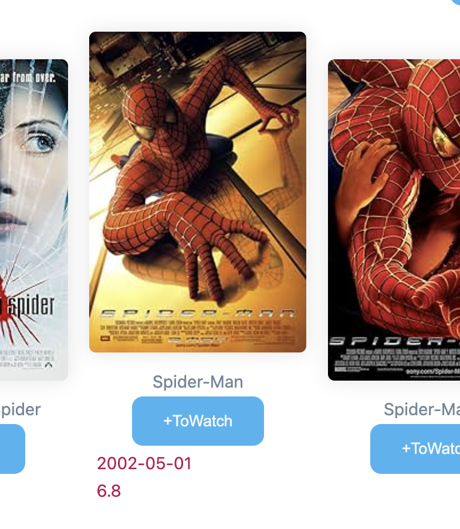
movie details
#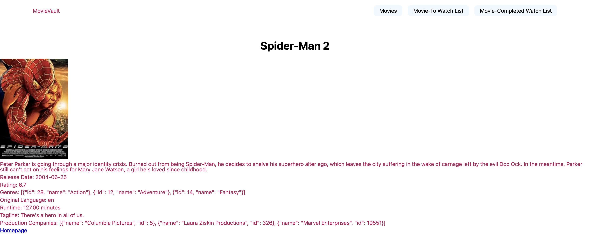
pagenation 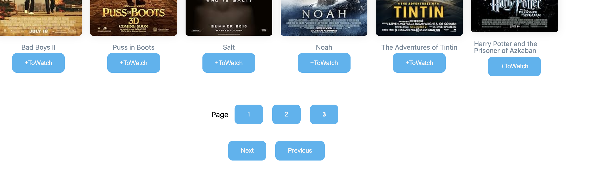
#
add to ToWatchList shortcut 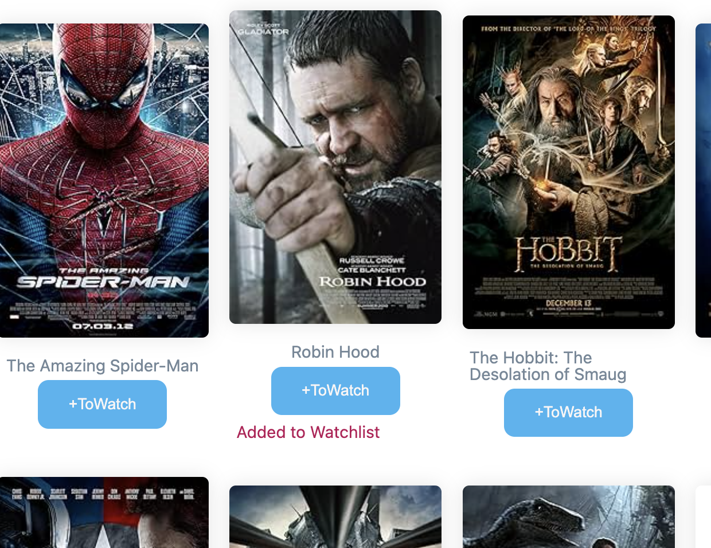
#
toWatchList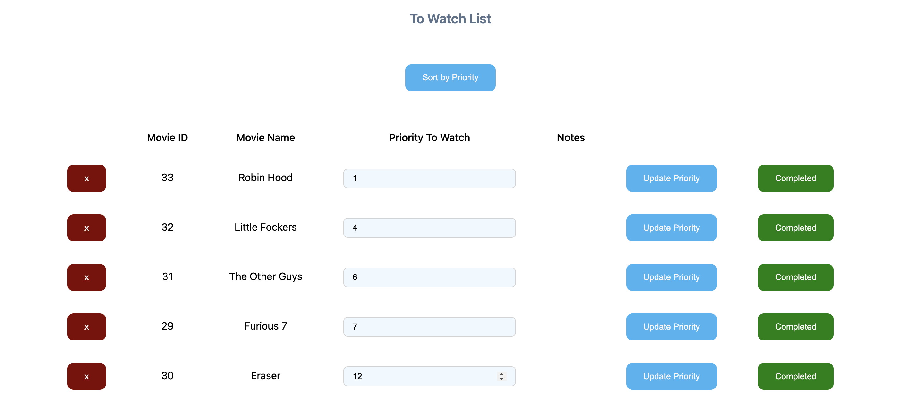
#
ToWatchList sorted by priority 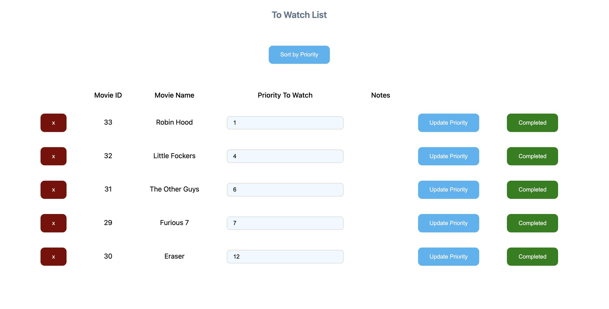
#
update priority 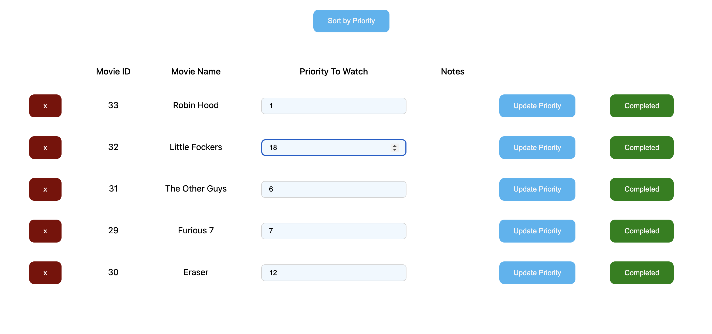
#
results 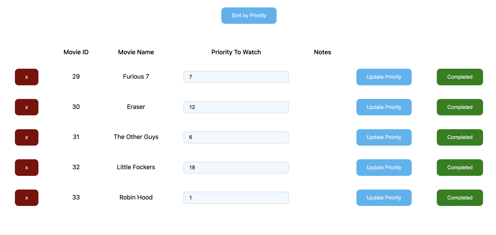
#
completedWatchList --> 
after clicking completed 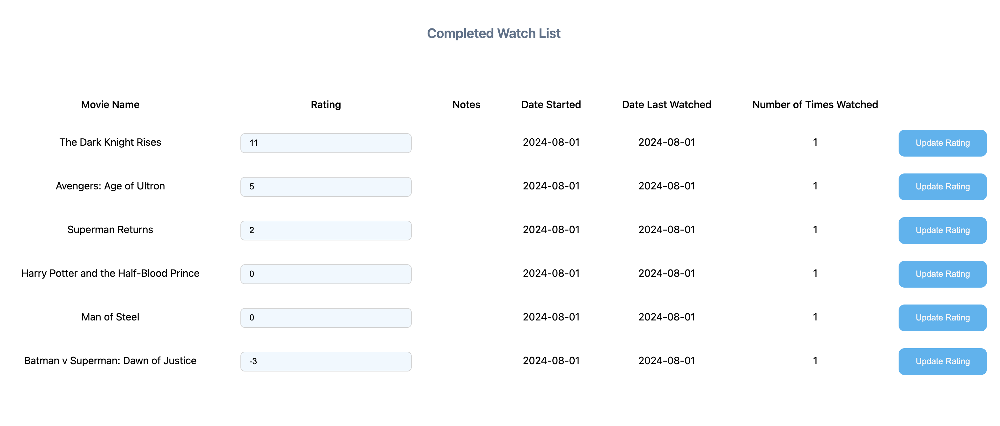
update rating 
rating in reverse order 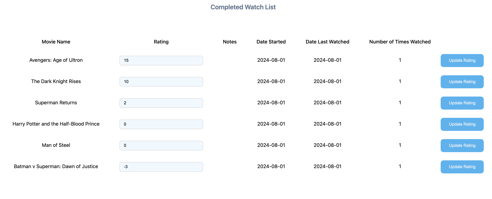

simple deletion 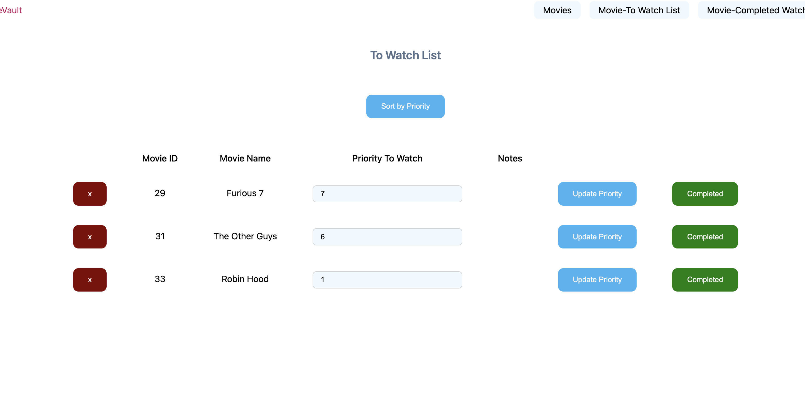
#